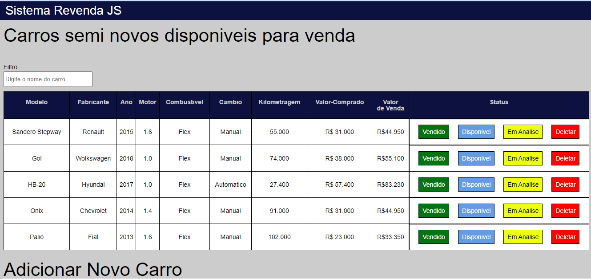

<h1 align ="center"> Plano de Teste</h1>
<h2> 1. Sistema de Revenda de Carro JS (SRCJS) </h2>

- Verificando o Design de Interface e a Usabilidade do site SRCJS

- link do do deploy https://devdouglasfigueiredo.github.io/Sistema-Revenda-Carro/

<h2> 2. Resumo do Projeto </h2>

- O SRCJS é um sistema de gerenciamento de veiculos, que tem as principais 
especificações dos veiculos em estoque como, modelo, fabricante, ano, 
combustivel, cambio, quilometragem, valor comprado, valor de venda.
Contando ainda o campo de filtro, onde o usuario pode encontrar as 
infomações de um determinado veiculo encontrando pela letra inicial do carro

- A interface da tabela dos veiculos tem a coluna de status, onde o vendedor 
poderá colocar a situação atual do veiculo, consiste nos botões de: vendido, 
disponivel e em analise. Tendo tambem a opção de deletar a linha da tabela 
com o botão delete, caso o carro ja tiver sido vendido

- O usario poderá adicionar um novo carro na tabela informando todas as
especificações obrigatórias do carro como: modelo, fabricante, ano e etc... 
quando o usuario informar no campo “valor comprado” do veiculo, o sistema 
automaticamente adicionará uma margem de 45% de lucro na coluna ”Valor de 
Venda” na tabela. Ex: o usurario informou que compraram o carro por 
R$30.000,00 (trinta mil reais) o sistema colocará o valor de 
R$45.000,00(quarenta e cinco mil reais) na tabela.

<h2>3. Resumo do Planejamento de teste</h2>

- Hipotese: crença inicial sobre a usabilidade do software a ser testado, seja 
boa ou não
-teste de usabilidade : deseja-se verificar se a usabilidade da interface visual
do sistema SRCJS é boa e para isso serão aplicados testes com usuarios 
pertencentes ao publico alvo.
- os testes serao feitos de forma manual, com as ferramentas Qase e Jmeters

<h2>4. Pessoas Envolvidas</h2>

- Analista de teste Douglas Figueiredo
- usuarios aleatorios para fazerem o teste de usabilidade

<h2>5. Estrategia de Teste</h2>

O plano de testes abrange todas as funcionalidades descritas acima. Esse 
plano de testes exclui a automatização de teste ate o momento
Testes Manuais: Todas as funcionalidades serão testadas manualmente pelo 
time de qualidade seguindo a documentação de Cenários de teste.
Teste de Performance: Será feito todos os teste de performance através da 
ferramente Jmeters

<h2>6. Relatórios de teste com a ferramenta Qase</h2>

- link do relatório https://app.qase.io/public/report/498932176ace6e20bd4b011f9a655a103587c36e

- No relatório está contido todas as infomações sobre os testes de funcionalidade que foram aprovados, assim como todos os detalhes dos bugs encontrados, como passo a passo e prints como prova.

<h2>7. Local dos teste Alfa e Beta</h2>

- O local dos testes será definido com o cliente, será feito no escritório ou 
tentaremos emular o ambiente real de uso

<h2>8. Classificação de Bugs</h2>
Os Bugs serão classificados com as seguintes severidades:

<h3>1- Bloqueador </h3>

- Bug que bloqueia o teste de uma função ou 
feature causa crash na aplicação.
- O Botão não funciona impedindo o uso 
completo da funcionalidade.
- Bloqueia release

<h3>2- Critico </h3>

Feature funciona pobremente
- Input esperados causam crash ou efeitos 
indesejados
- Input incomum causa efeitos irreversíveis

<h3>3- Maior </h3>

Feature não atinge certos critérios de aceitação, mas 
sua funcionalidade em geral não é afetada
- Mensagem de erro ou sucesso não é exibida
- Input incomum causar efeitos indesejados, mas 
contornáveis

<h3>4- Menor</h3>

Quase nenhum impacto na funcionalidade, mas ainda 
é um erro válido
- Erro ortográfico
- Pequenos erros de UI
